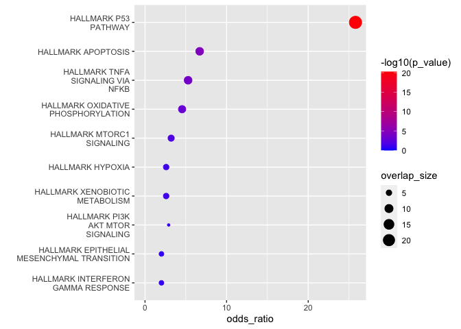
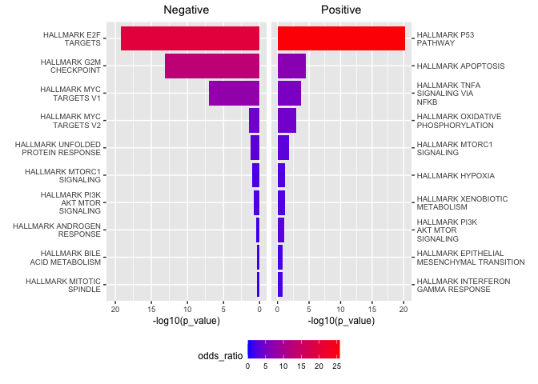

cdsrplots
================

cdsrplots contains standard CDS plots and themes.

## Install

``` r
library(devtools)
devtools::install_github("broadinstitute/cdsr_plots")
```

The package can then be loaded by calling

``` r
library(cdsrplots)
```

## Functions

  - Plotting
      - make\_volcano
      - make\_gsea\_dot
      - make\_gsea\_bar
  - Theme
      - theme\_publication
      - scale\_fill\_publication
      - scale\_color\_publication

## Volcano plot

The `make_volcano` function is a quick and easy tool to visualize
results from differential expression/dependency analyses and can be
easily customized.

### Example data

As an example we will load the results of a differential expression
anlyses comparing Nutlin treated cells to DMSO treated cells.

``` r
nutlin <- read_csv("./nutlin.csv")
nutlin %>% head()
```

    ## # A tibble: 6 x 3
    ##   gene   logFC   p_value
    ##   <chr>  <dbl>     <dbl>
    ## 1 CDKN1A 1.31  2.82e-166
    ## 2 MDM2   0.994 5.12e-155
    ## 3 GDF15  0.977 3.33e-146
    ## 4 SUGCT  0.708 1.03e-139
    ## 5 RPS27  0.366 3.80e- 97
    ## 6 FDXR   0.679 1.04e- 96

### Base plot

Make a simple plot by providing the data frame and variable names for
effect size and significance.

``` r
cdsrplots::make_volcano(nutlin, 'logFC', 'p_value')
```

<!-- -->

### Add labels

Provide `label_var`, a column containing labels for the data points.

  - By default `rank_by` = ‘effect’ and `n_labeled` = 10, meaning that
    the 10 left-/right-most points will be labeled, ranked by effect
    size
  - If `rank_by` = ‘pval’, the `n_labeled` most significant points will
    be labeled
  - Otherwise, user may specify custom points to label with logical
    vector `label_bool`.

<!-- end list -->

``` r
cdsrplots::make_volcano(nutlin, 'logFC', 'p_value', label_var = 'gene')
```

<!-- -->

``` r
nutlin %>% dplyr::mutate(top_5_sig = rank(p_value) <= 5) %>% 
  cdsrplots::make_volcano('logFC', 'p_value', label_var = 'gene', 
                          label_bool ='top_5_sig',ggrepel_type = 'label')
```

<!-- -->

### Add colors

Provide `color_var`, a categorical column for coloring purposes.

  - By default, a grey background/red highlight dual color scheme is
    used for logical vectors. For all other vector classes, colors are
    set to categories arbitrarily.
  - Otherwise, user may specify custom colors to use with color\_values.

<!-- end list -->

``` r
nutlin %>% dplyr::mutate(fdr = p.adjust(p_value, method = 'fdr')) %>% 
  cdsrplots::make_volcano('logFC', 'p_value', q_var = 'fdr')
```

<!-- -->

``` r
location_colors <- c('left' = '#D95F02', 'right' = '#7570B3', 'bottom' = '#333333')

nutlin %>% 
  dplyr::mutate(location = ifelse(logFC < 0, 'left', 'right')) %>% 
  dplyr::mutate(location = ifelse(p_value > 1e-10, 'bottom', location)) %>% 
  cdsrplots::make_volcano('logFC', 'p_value', color_var = 'location', color_values = location_colors)
```

<!-- -->

### Extending functionality with ggplot

Since make\_volcano returns a ggplot object, you can make more tweaks
using the ggplot
syntax.

``` r
cdsrplots::make_volcano(nutlin, 'logFC', 'p_value') + cdsrplots::theme_publication()
```

<!-- -->

``` r
volcano <- nutlin %>% dplyr::mutate(top_5_sig = rank(p_value) <= 5) %>% 
  cdsrplots::make_volcano('logFC', 'p_value', label_var = 'gene',color_var = 'top_5_sig',
                          label_bool ='top_5_sig',ggrepel_type = 'label')
volcano + aes(size = top_5_sig) + scale_size_manual(values = c(1,3))
```

<!-- -->

## Gene set enrichment plots

The `make_gsea_dot` and `make_gsea_bar` functions are a quick and easy
way to visualize the results of a gene set enrichment analysis. The
functions are designed to work with the
[cdsrgsea](https://github.com/broadinstitute/cdsr_gsea) package but they
are fexible enough to work with other GSEA packages.

### Example data

As an example we will look for enriched gene sets from the HALLMARK
collection using the hypergeometric
test.

``` r
gene_sets <- cdsrgsea::load_gene_sets()
```

``` r
nutlin_gsea <- cdsrgsea::run_hyper(nutlin,gene_sets$Hallmark,gene_var = "gene", rank_var = "logFC")
nutlin_gsea %>% head()
```

    ## # A tibble: 6 x 8
    ##   term          p_value p_adjust odds_ratio direction  size overlap_size overlap
    ##   <chr>           <dbl>    <dbl>      <dbl> <chr>     <int>        <int> <list> 
    ## 1 HALLMARK_P5… 5.52e-21 2.76e-19      25.8  pos         200           24 <chr […
    ## 2 HALLMARK_E2… 6.37e-20 3.19e-18      19.8  neg         200           25 <chr […
    ## 3 HALLMARK_G2… 7.38e-14 1.85e-12      13.2  neg         200           20 <chr […
    ## 4 HALLMARK_MY… 8.95e- 8 1.49e- 6       7.61 neg         200           14 <chr […
    ## 5 HALLMARK_AP… 3.33e- 5 8.32e- 4       6.70 pos         161            9 <chr […
    ## 6 HALLMARK_TN… 1.81e- 4 3.02e- 3       5.28 pos         200            9 <chr […

### Base plot

Make a simple bar plot by providing the data frame returned by
`cdsrgsea`.

``` r
cdsrplots::make_gsea_bar(nutlin_gsea)
```

<!-- -->

The default variable names match the variable names returned by
`cdsrgsea`.

  - `enrich_var` specifies the column containing the enrichment values.
    By default `enrich_var` = ‘odds\_ratio’ for hypergeometric and ‘NES’
    for GSEA.
  - `size_var` specifies the column containing the sizes. By default
    `size_var` = ‘overlap\_size’ for hypergeometric and ‘size’ for GSEA.
  - `p_var` specifies the column contianing the significance values. By
    default `p_var` = ‘p\_value’

Variable names can changed to work with other GSEA packages or to
customize the plots. For example we can set`p_var` to ‘p\_adjust’
instead of ‘p\_value’.

``` r
cdsrplots::make_gsea_dot(nutlin_gsea,p_var = 'p_adjust')
```

<!-- -->

### Single direction

The direction parameter `dir` can be set to ‘pos’ to only shown positive
terms or ‘neg’ to only show negative terms

``` r
cdsrplots::make_gsea_dot(nutlin_gsea,dir = "pos")
```

<!-- -->

### Change coloring

The `color_by` argument sets how the plot is colored. There are three
options

  - ‘pval’ - colors by significance
  - ‘dir’ - colors by the direction of the enrichment
  - ‘enrich’ - colors by enrichment

<!-- end list -->

``` r
cdsrplots::make_gsea_bar(nutlin_gsea, color_by = "dir")
```

<!-- -->

### Change x-axis

The `x_by` argument sets which variable is plotted on the x-axis. There
are two options

  - ‘pval’ - the significance is plotted on the x-axis
  - ‘enrich’ - the enrichment is plotted on the
x-axis

<!-- end list -->

``` r
cdsrplots::make_gsea_bar(nutlin_gsea, color_by = "enrich", x_by = "pval")
```

<!-- -->

### Change y-axis

There are a number of parameters that modify the y-axis

  - `n_shown` sets the number of terms which are shown.
  - `sig_only` determines whether only significant terms are shown.

<!-- end list -->

``` r
cdsrplots::make_gsea_dot(nutlin_gsea,sig_only = T)
```

<!-- -->
